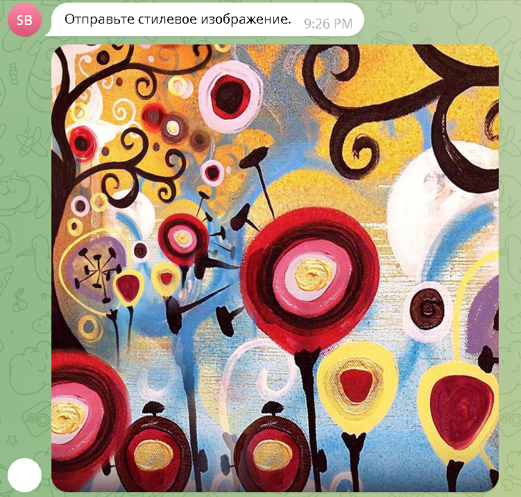
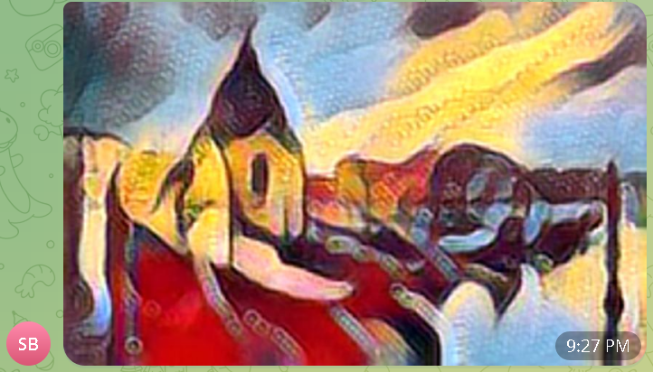

# Telegram style transfer bot

## Описание

Этот телеграм бот переносит стиль с одного изображения на другое. Для этого используется нейронная сеть, описанная <a href="https://github.com/zhanghang1989/PyTorch-Multi-Style-Transfer"> тут</a>. 

## Использование

Для взаимодействия с ботом используются три команды:
- /start - для начала работы
- /select_style - для выбора стилевого изображения
- /transfer_style - для отправки изображения, которое будет обработано моделью

## Установка

### Первый способ

```
git clone https://github.com/al-volkov/telegram-bot.git
cd telegram-bot
pip install -r requirements.txt
python app.py
```

### Второй способ

```
git clone https://github.com/al-volkov/telegram-bot.git
cd telegram-bot
docker-compose up --build
```

### Токен

Помните, что вам необходимо определить TG_BOT_TOKEN.

## Пример работы





## Обучение нейросети

Обучение нейросети с нуля - в [ноутбуке](msng_net_train.ipynb)